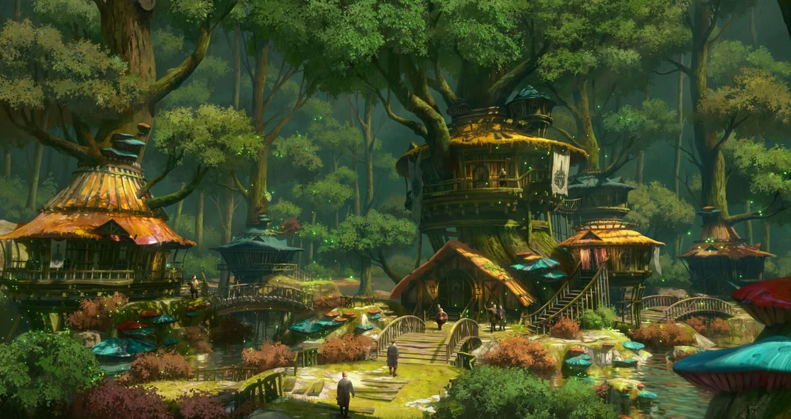

A quiet village at the edge of the Forest of Light.

Home to Noon, Akira and Wes.

Noon made this place her home after the Aneridge Scourge incident in an attempt to lay low and escape the brightstriders wrath.

At this point Noon had already saved a young Akira from a trap in the forest of light, raising her on the outskirts of Mirefield. In time Akira grew up and fell in love with Wes, a young carpeter. Eventually the two move in together in the village proper, living a happy life and preparing for a potential child. 

Then Wes goes missing and Noon and Akira team up once more to go find him. 

### Tid bits over time
- Noon used to scare the children with spooky stories. 
- Akira lost her arm to Pascal-Felipe in the town square when she stood up for Wes.
- The local smith Vangih Keotum has created the prosthetics for Akira.

> Art by [Wibble](https://www.artstation.com/artwork/aGaOZ9)