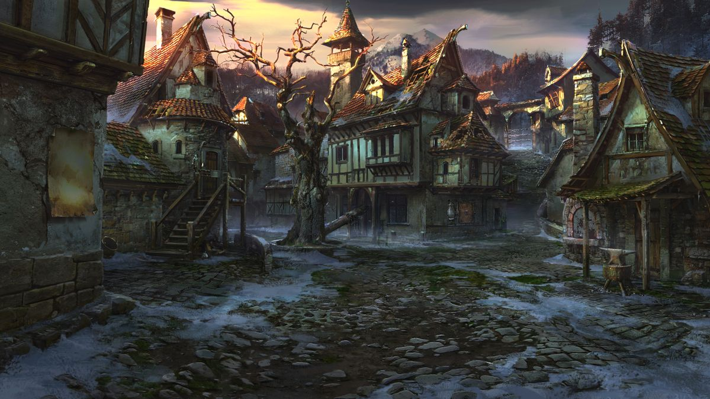

This is where this story starts, our heroes met here in Narthwith to attend the first on-field test of the ivory dominions first generation of battle ready automatons - our heroes barely manages to escape and continued to flee into the red forest. 

> Art by VityaR83