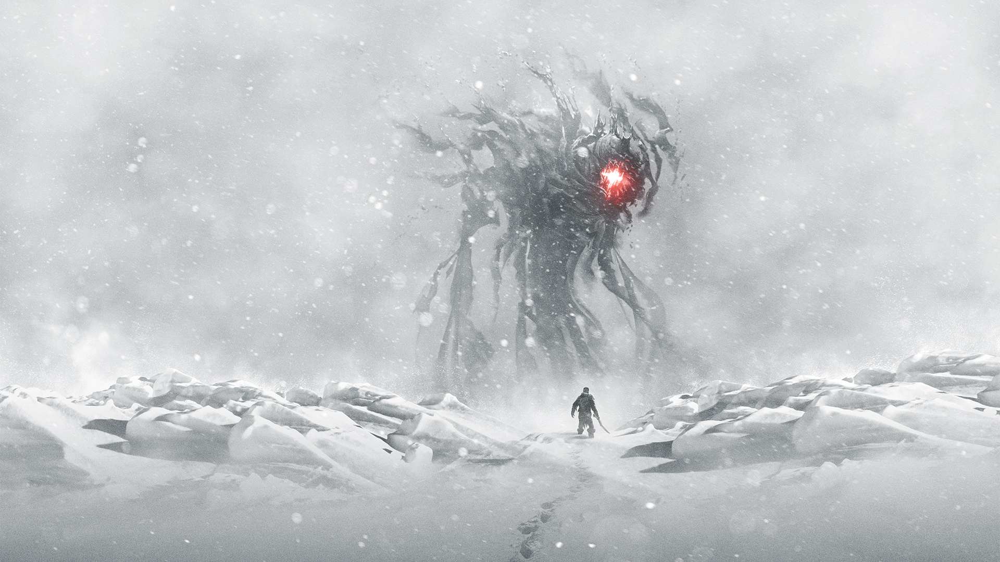

The Everwinter is a powerful spirit of unknown origin that some 60 years ago has arrived in the region around Farside. The druids that called Farside their home where suddenly faced with attacks from monsters conjured by the Everwinter, as well as an eternal winter. 

The druids turned to the mountains for warmth and in them they found the metals which would be used in the industrialisation that would mark a new age in this worlds history books. 
With the metals and the coal they found they build ovens and pipes to transport steam to heat their homes. This allowed them to expand from the settlement in the mountains, New Farside, back into the valley and reclaim their original grove. 

The war against the Everwinter kept raging for many decades. Only 23 years ago, 37 years after the Everwinter has arrived in this region, 6 brave heroes rallied and lead a automaton force against the Everwinter. 
This was not the first attempt to kill or contain the Everwinter, but all previous attempts have failed. It is said that the Everwinters temptations are impossible to resist. Any mortal getting close enough to hear its whispers carried on the icy winds would turn to stand at the Everwinters side. 

To combat this, metal machines were created, immune to those same whispers and led into battle by those same brave heroes.

The heroes were eventually succesfull and contained the Everwinter in a artifact, ending its reign of terror. Upon their return the druids bestowed them with titles, land and knighthood and from then on these heroes are known as the Emerald Knights. They received land in the very valley, on druidic hallow ground, showing the deep resepect the druids harbor for these warriors. 

> Artists interpretation of a knight facing the Everwinter, which has manifested as a enourmous monster.