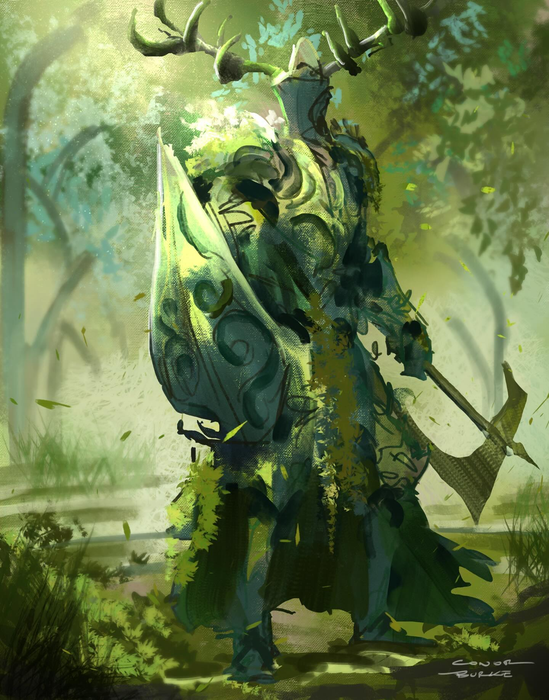

A travelling knight, once part of the Emerald Knights. Has taken on Cashwyn as an squire and is travelling with Clank through the lands. 
On his travels Caster has been visiting other knights orders and has been gathering something and preparing his return to the Farside Emerald Knights, it is unknown what he was preparing. 

## Clank 

Clank is a full metal soulful horse that has been at Casters side ever since he left Farside. 