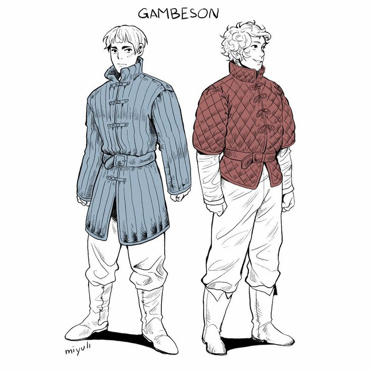

Squire to Caster and apprentice to Bernice in Arms & Arms.

On one hand, very recently, Cashwyn has become a smiths apprentice to Bernice working in Arms & Arms alongside her. 

On the other hand he has been travelling with Caster as a Squire and knight apprentice for a while, honing his skills and studying the knights codex. 

## Rusty 
A stray dog that has lost a leg and has been taken in by Cashwyn. Bernice helped create prosthetics for Rusty. 
