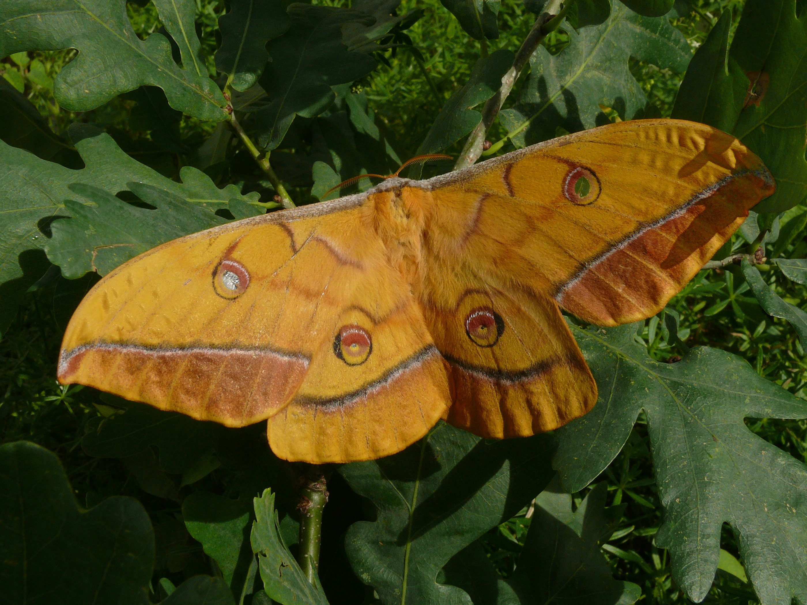

Litha is a witch dealing in all things occult in this modern world. She ownes and operates the shop called the Chrimson Moth. 

Litha is accompanied by a large butterfly, a japanese silk moth (Japanese Oak Silkmoth) called Anthea.
Anthea isnt a fan of sunlight and often hides away.  

> Anthea sitting on a plant