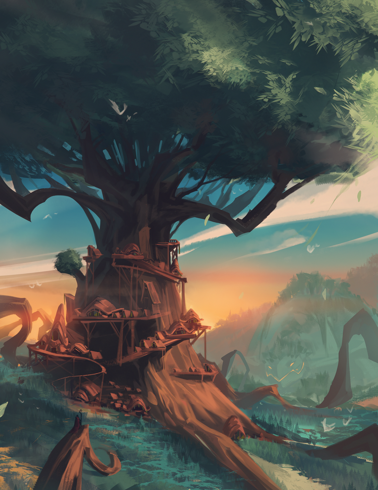
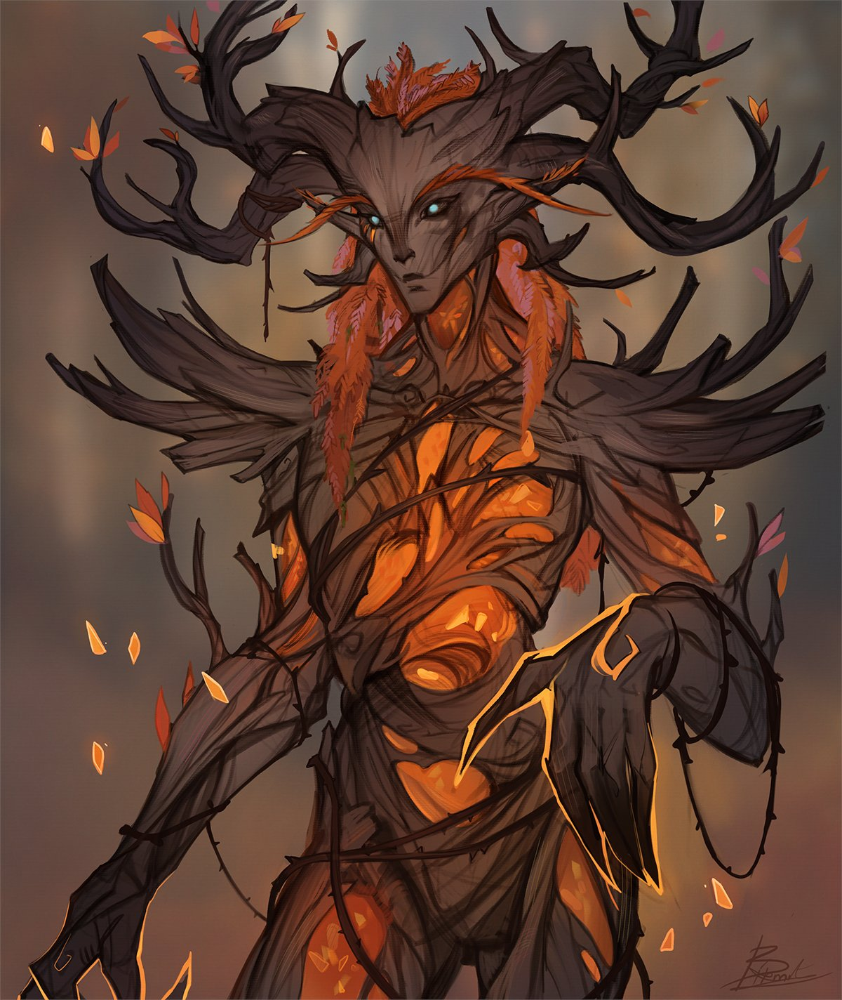

The tree has been frozen as the druids retreated to New Farside in the first years of the Everwinter. It has been reclaimed in time for the tree to survive, but it is heavily damaged. The druids have since begun to reinforce the tree with metal, to mend and repair what they can. Depite the cold that remains dep within the wood, their hope is that this tree and the spirit that lives within will survive many more centuries. 

> The ancient tree before the Everwinter befell Farside

> The spirit that resides within the tree and that watches over the grove manifesting into a humanoid shape.