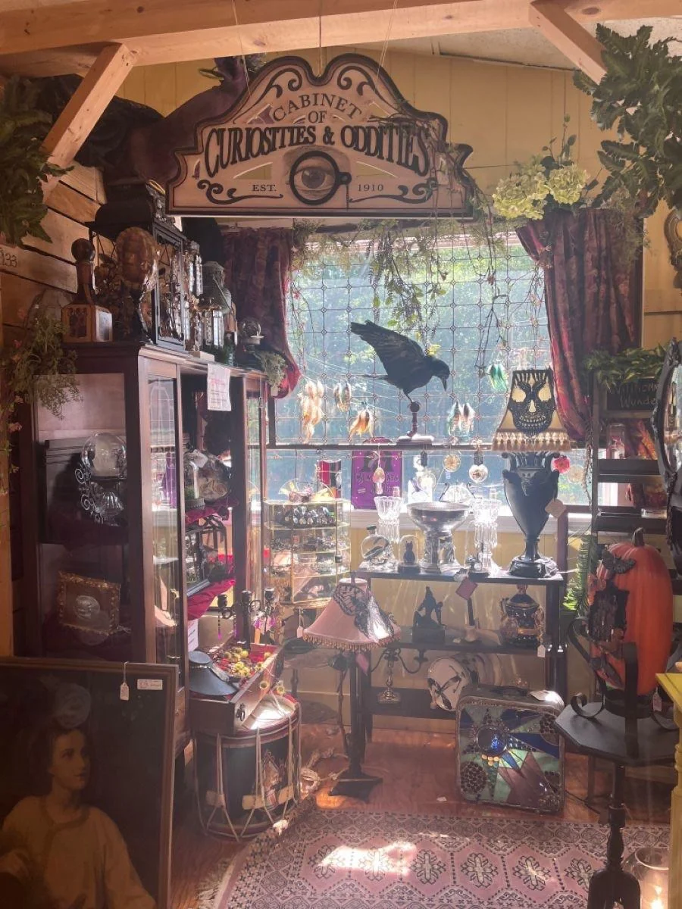

**Location:** New Farside

A small witches store dealing in all manner of occult things, owned and operated by Litha.

Part of a row of residential houses, this store is tucked away in an unexpected place. Lithas apartment is located right above the store.
The inside of the store appeals to that pull of the occult. Stepping inside, is like stepping into a different world as one is greeted by colorful rugs lining the walls, covered in runes. The store is an organised mess, various things such as figures, pictures, notes, drawings, crystals, bones, taxidermied animals, bottles with questionable contents and other trinkets are littered everywhere. Dried herbs hang from the ceiling, providing a unique scent to the place. A cauldron bubbles in the back of the store.

This is no doubt a modern witches hut.

> A look out of the Chrimson Moths street facing window.

