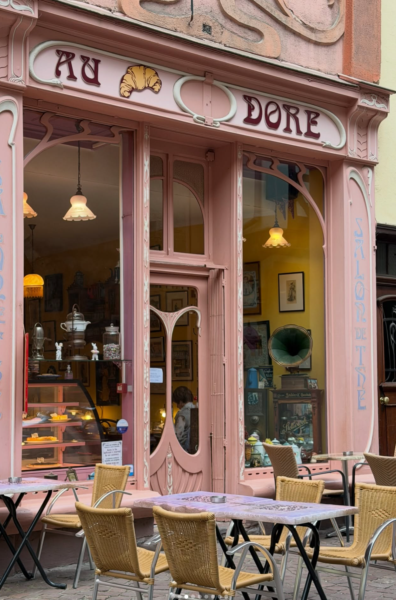

**Location:** Border of Old Farside and New Farside, right next to one of the heating walls.

The fusion of Old and New Farside channeled into a Cafe. The Lissis Cafe has gathered city wide renown in record time and is loved by many. Pink cherry blossoms decorate the alleyway where this cafe is located. 

