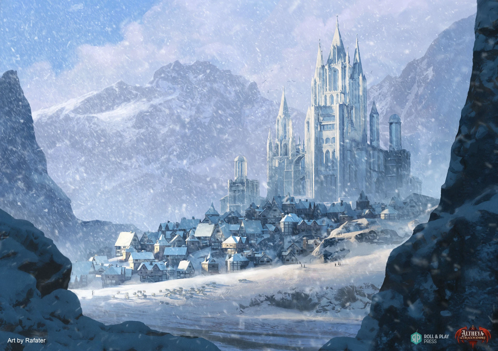

A secondary town center, located in a nearby mountain, protected from the elements. The very first and biggest workshops reside here.

> A look into one of the many workshops that are nestled away in New Farside

> New Farside expanding outside of the Mountains