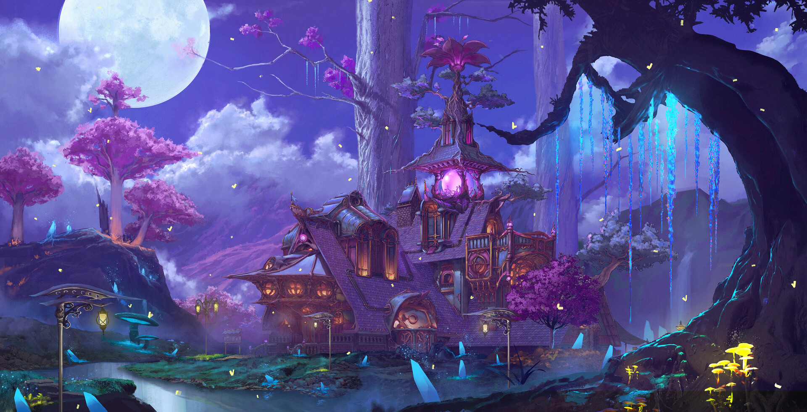

The original center of Farside's druids' grove. Farside resides within a giant valley that used to be filled with luscious fields and forests. Nowadays, multiple smaller forests, remnants of Farside's past, can be found throughout the city. It is surrounded on all sides by New Farside, the borders between Old and New marked by enourmous metal walls that keep the valley warm.

